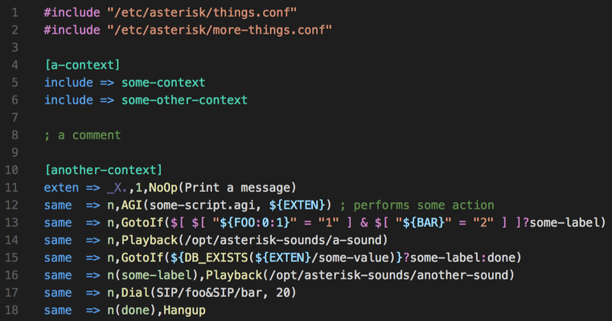

Syntax highlighting for [Asterisk dialplan](https://docs.asterisk.org/Configuration/Dialplan/).

## Features

Association with `.conf` files.

Highlighting scopes include applications, functions, variables, expressions, extension patterns and priority labels.

### Snippets

Quickly insert new extensions by entering the shorthand and pressing TAB. Two variations are available:

-   `e`: insert a new `exten =>` with tab stops at extension pattern, priority, application and application data
-   `s`: insert a new `same =>` with tab stops at priority, application and application data
-   `en`: insert a new `exten =` with tab stops at extension pattern, priority, application and application data
-   `sn`: insert a new `same =` with tab stops at priority, application and application data

## Known Issues

No support for AEL/AEL2.
